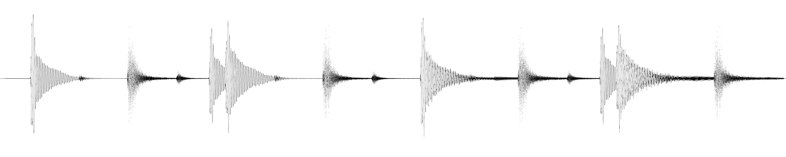
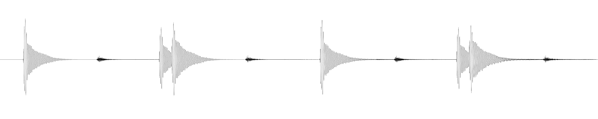
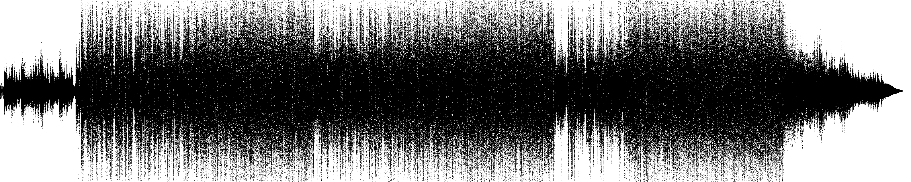
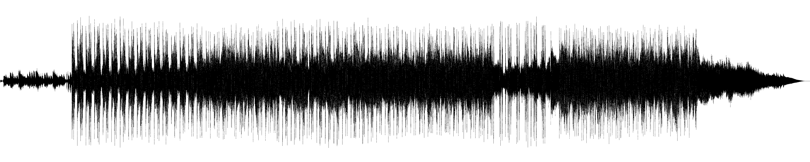
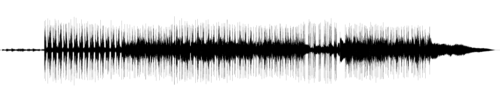

# Rust: `no_std` digital low pass filter library
This is a `no_std` Rust library for simple digital low pass filters. You can use it for example to
get the low frequencies from a song.

**I'm not an expert on digital signal processing. Code contributions are highly welcome! :)**

## Difference to `biquad`
**⚠ TL;DR: Prefer crate `biquad` and use this crate only for educational purposes.** \
This crate provides a basic and simple to understand, first order lowpass filter. The [biquad](https://crates.io/crates/biquad)
crate offers second order filters, with higher accuracy. Due to my testing, a lowpass filter with `biquad` has the same
computational costs as my crate, but offers a **better resolution for actually cutting of signals above the
cut-off frequency while the preserved signal will be less attenuated**, compared to my filter implementation.
For production, please use `biquad`.

## How to use
```rust
use lowpass_filter::lowpass_filter;

/// Minimal example how to use this crate/how to apply low pass filter.
fn main() {
    // read this from MP3 for example
    let mut mono_audio_data = [0.0, 1.0, -5.0, 1551.0, 141.0, 24.0];
    // mutates the input buffer
    lowpass_filter(&mut mono_audio_data, 44100.0, 120.0);
}
```

## Visual Examples
### #1: Original Waveform of a short sample

### #1: Lowpassed Waveform

### #2: Original Waveform of a song

### #2: Lowpassed Waveform

### #2: 3x Lowpassed Waveform

