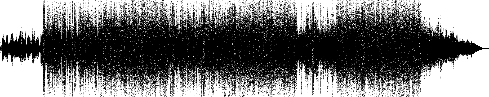

# Rust: `no_std` digital low pass filter library
This is a `no_std` Rust library for simple digital low pass filters. You can use it for example to 
get the low frequencies from a song.

**I'm not an expert on digital signal processing. Code contributions are highly welcome! :)**

## How to use
```rust
use std::path::PathBuf;
use std::fs::File;
use audio_visualizer::waveform::staticc::png_file::visualize;
use audio_visualizer::{Channels, ChannelInterleavement};
use lowpass_filter::simple::sp::apply_lpf_i16_sp;
use minimp3::{Decoder as Mp3Decoder, Frame as Mp3Frame, Error as Mp3Error};

/// This example reads a MP3, applies a digital low pass filter and visualizes
/// the waveform in the end.
fn main() {
    let mut path = PathBuf::new();
    path.push("test/samples");
    path.push("sample_1.mp3");
    let mut decoder = Mp3Decoder::new(File::open(path).unwrap());

    let mut lrlr_mp3_samples = vec![];
    loop {
        match decoder.next_frame() {
            Ok(Mp3Frame { data: samples_of_frame, .. }) => {
                for sample in samples_of_frame {
                    lrlr_mp3_samples.push(sample);
                }
            }
            Err(Mp3Error::Eof) => break,
            Err(e) => panic!("{:?}", e),
        }
    }
    // split into left and right channel
    let (mut left, mut right) = Channels::Stereo(ChannelInterleavement::LRLR)
        .stereo_interleavement()
        .to_channel_data(&lrlr_mp3_samples);


    // left: low pass filter with i16 samples in single precision
    apply_lpf_i16_sp(&mut left, 44100, 120);
    // right: lpf with i16 samples in single precision
    apply_lpf_i16_sp(&mut right, 44100, 120);

    // visualize audio as waveform in a PNG file
    visualize(
        &left,
        Channels::Mono,
        "test/out",
        "sample_1_waveform_lowpassed_left.png"
    );
    visualize(
        &right,
        Channels::Mono,
        "test/out",
        "sample_1_waveform_lowpassed_right.png"
    );
}
```

## Visual Examples
### #1: Original Waveform of a short sample

### #1: Lowpassed Waveform

### #2: Original Waveform of a song

### #2: Lowpassed Waveform

### #2: 3x Lowpassed Waveform

