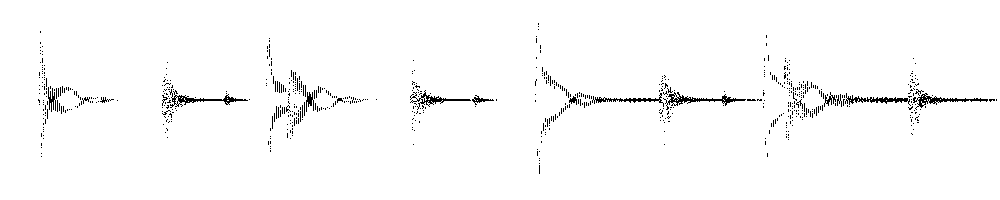
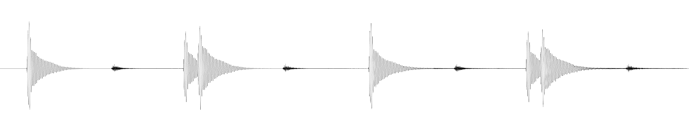
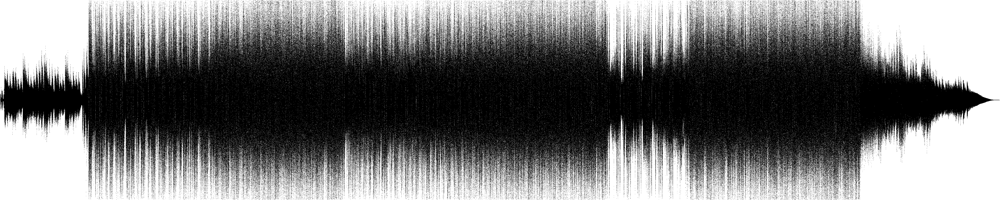
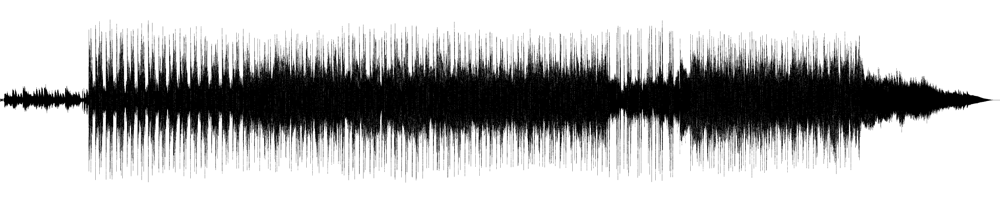
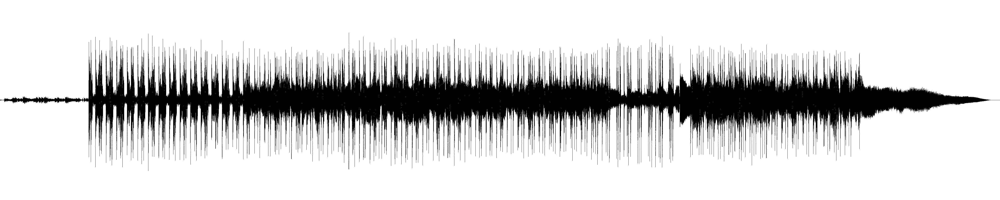

# lowpass-filter

High performance `no_std` lowpass filter for digital signal processing.

This crate implements a simple first-order digital lowpass filter for `f32`
and `f64` samples. Use it, for example, to extract the bass from a song or to
smooth noisy sensor data. It has no dependencies, no `unsafe` code, and
performs no allocations, making it suitable for any target from desktop to
embedded.

Samples must be in range `-1.0..=1.0`, which is the default in DSP.

## Usage

To filter a buffer of samples in one go, use `lowpass_filter_slice` (or
`lowpass_filter_slice_f64`). This is the fastest option: it processes samples
in blocks that compilers auto-vectorize (SIMD), several times faster than
per-sample processing.

```rust
use lowpass_filter::lowpass_filter_slice;

// Mono audio samples, recorded at 44.1 kHz sample rate.
let mut samples = [0.0, 0.3, -0.6, 0.8, 0.5, -0.2];
// Only keep frequencies below 120 Hz; mutates the buffer in-place.
lowpass_filter_slice(&mut samples, 44100.0, 120.0);
```

For streaming data, e.g. in an audio callback, keep a `LowpassFilter` around:
its state carries over between calls, so chunked processing equals processing
everything at once. It also filters single samples, e.g. inside iterator
chains.

```rust
use lowpass_filter::LowpassFilter;

let mut filter = LowpassFilter::<f32>::new(44100.0, 120.0);
// Process data as it arrives (fast block processing) ...
for mut chunk in [[0.0, 0.3, -0.6, 0.8], [0.5, -0.2, 0.1, 0.4]] {
    filter.run_slice(&mut chunk);
}
// ... or one sample at a time.
let filtered = filter.run(0.25);
```

The iterator-based `lowpass_filter` and `lowpass_filter_f64` functions are
convenient when the samples do not live in a slice.

## Comparison with `biquad`

For the equivalent first-order lowpass (`Type::SinglePoleLowPass`), this
crate outperforms the [biquad](https://crates.io/crates/biquad) crate:
roughly 1.5x throughput with the iterator-based API and 5-6x with the
slice-based API (x86_64), as `biquad` processes samples strictly one at a
time.

`biquad` is the better choice for sharp frequency separation or other
filter types (highpass, bandpass, notch, EQ): its second-order filters
roll off at 12 dB/octave instead of 6, with a configurable Q factor.

## Visual Examples
### #1: Original Waveform of a short sample

### #1: Lowpassed Waveform

### #2: Original Waveform of a song

### #2: Lowpassed Waveform

### #2: 3x Lowpassed Waveform


# MSRV
The MSRV is `1.88.0`.
