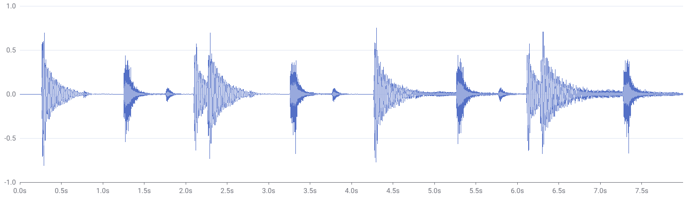
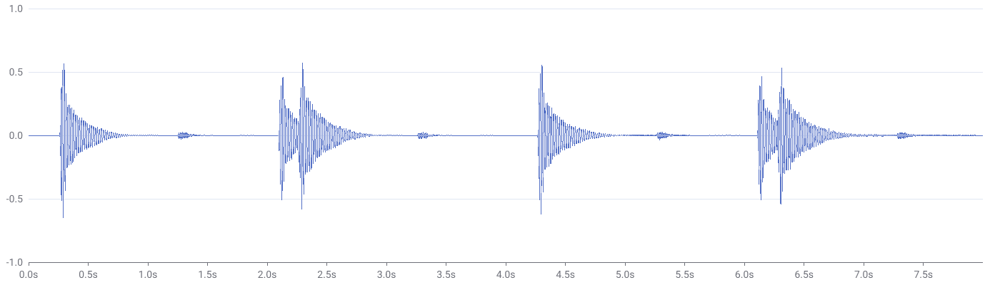
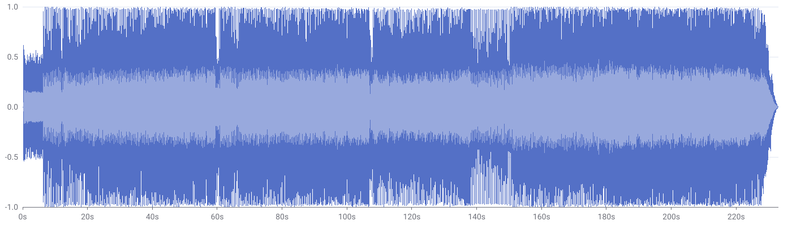
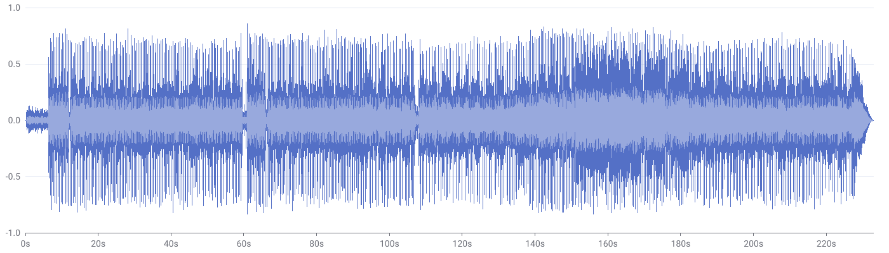
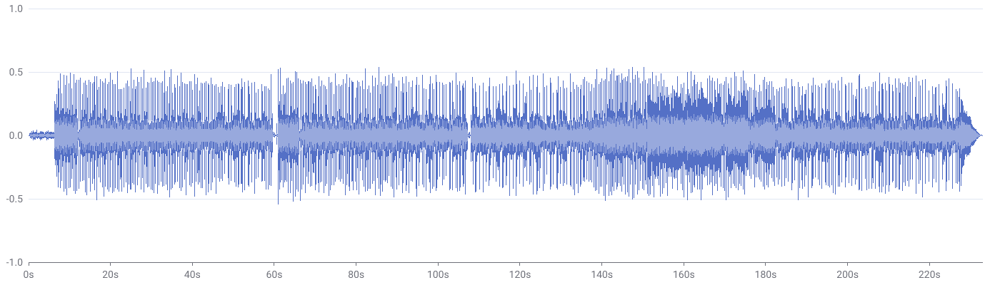

# lowpass-filter

High performance `no_std` lowpass filter for digital signal processing.

This crate implements a simple first-order digital lowpass filter for `f32`
and `f64` samples. Use it, for example, to extract the bass from a song or to
smooth noisy sensor data. It has no dependencies, no `unsafe` code, and
performs no allocations, making it suitable for any target from desktop to
embedded.

Samples should be in range `-1.0..=1.0`, which is the default in DSP.

## Usage

```rust
use lowpass_filter::LowpassFilter;

// Mono audio samples, recorded at 44.1 kHz sample rate.
let mut samples = [0.0_f32, 0.3, -0.6, 0.8, 0.5, -0.2];
// Only keep frequencies below 120 Hz; mutates the buffer in-place.
LowpassFilter::new(44100.0, 120.0).run_slice(&mut samples);
```

For streaming, per-sample processing, and more examples, see the
[documentation](https://docs.rs/lowpass-filter).

## Performance

**TL;DR:** Prefer `run_slice`: it is 1.8-4.1x faster than per-sample
processing and 2.7-6.2x faster than `biquad`. For streaming, create the
filter once and reuse it.

Measured on an AMD EPYC 9634 (Zen 4) with Rust 1.99, filtering one second of
audio (44100 samples) with a fresh filter.

- _Default_: compiled for the baseline `x86_64` CPU, which only guarantees
  SSE2 with 128-bit SIMD registers. This is how most crates and binaries are
  built.
- _Native_: compiled with `-C target-cpu=native`, which enables all CPU
  features of the test machine, including AVX-512 with 512-bit SIMD
  registers. Such binaries do not run on CPUs without these features.

Throughput in million samples per second, higher is better:

| API                                      | f32 default | f32 native | f64 default | f64 native |
|------------------------------------------|------------:|-----------:|------------:|-----------:|
| `LowpassFilter::run`                     |         599 |        599 |         597 |        600 |
| `LowpassFilter::run_slice`               |        1719 |       2474 |        1090 |       2008 |
| `biquad` (`DirectForm2Transposed`)       |         396 |        400 |         398 |        398 |

When processing audio in buffers of 64 samples, reusing one filter is
1.2-1.5x faster than creating a new one per buffer, and reaches 80-90% of the
throughput of filtering one long slice.

### Comparison with `biquad`

For the equivalent first-order lowpass (`Type::SinglePoleLowPass`), this
crate outperforms the [biquad](https://crates.io/crates/biquad) crate:
1.5x throughput with per-sample processing (`run`) and 2.7-6.2x with slice
processing (`run_slice`), depending on the sample type and enabled CPU
features, as `biquad` processes samples strictly one at a time.

`biquad` is the better choice for sharp frequency separation or other
filter types (highpass, bandpass, notch, EQ): its second-order filters
roll off at 12 dB/octave instead of 6, with a configurable Q factor.

### Running the Benchmarks

```sh
# Baseline CPU features
cargo bench -- --save-baseline generic
# All CPU features of this machine, compared against the run above
RUSTFLAGS="-C target-cpu=native" cargo bench -- --baseline generic
# Quick and rough, without touching saved results
cargo bench -- --quick --noplot --discard-baseline
```

Pass a filter to run a subset, e.g. `cargo bench -- streaming/f32`. The HTML
report is written to `target/criterion/report/index.html`.

## Visual Examples
### #1: Original Waveform of a short sample

### #1: Lowpassed Waveform

### #2: Original Waveform of a song

### #2: Lowpassed Waveform

### #2: 3x Lowpassed Waveform


# MSRV
The MSRV of the library is `1.88.0`. The MSRV of the benches, examples, and
tests in this repository is `1.95.0`.
